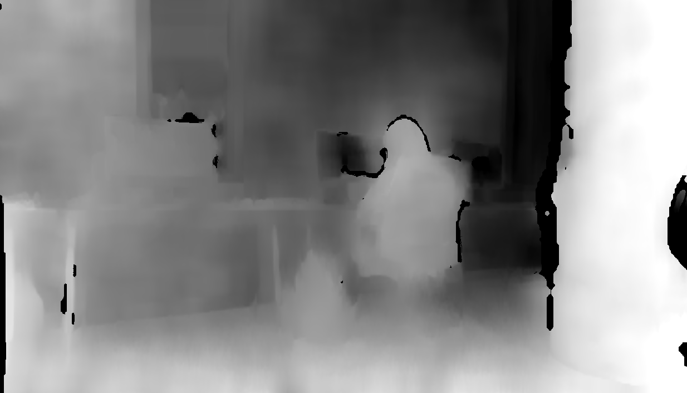
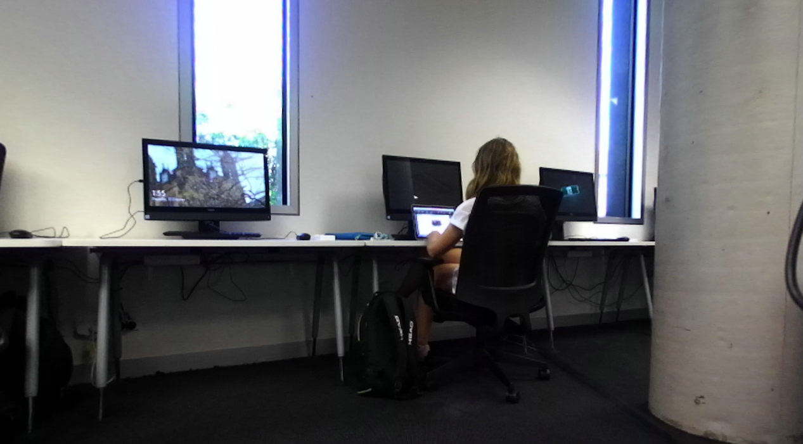
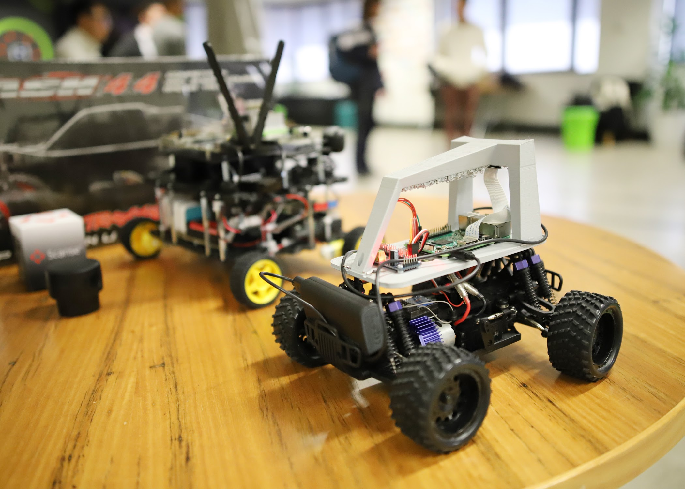
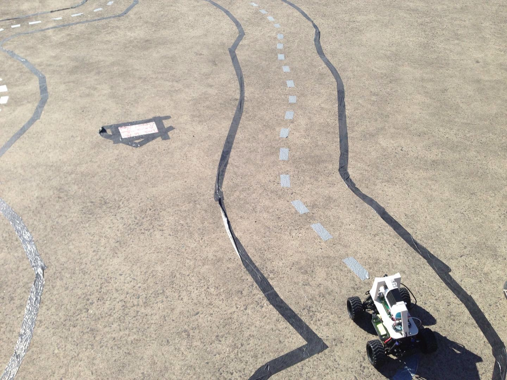

# Captsone project USYD

This repository contains code from the capstone project for the final year of my degree.

## Project Goal

In this project the goal is to use the MIT car and Donkey car hardware to build a self driving car.

During this project I worked on both the software and hardware development of the car. My role in the project had a particular focus on developing and training the Neural Network we used for navigation and integrating it with the car.

**Links;**
* [Donkey Car](https://github.com/wroscoe/donkey)
* [MIT Car](https://github.com/mit-racecar/)

## Computer Vision

OpenCV was used to create depth maps from the stereo cameras.

Normal image

Depth Map (darker = further away)

## Photos

Donkey car (3d printed mount on RC car with raspberry pi)

Collecting training data on the track

